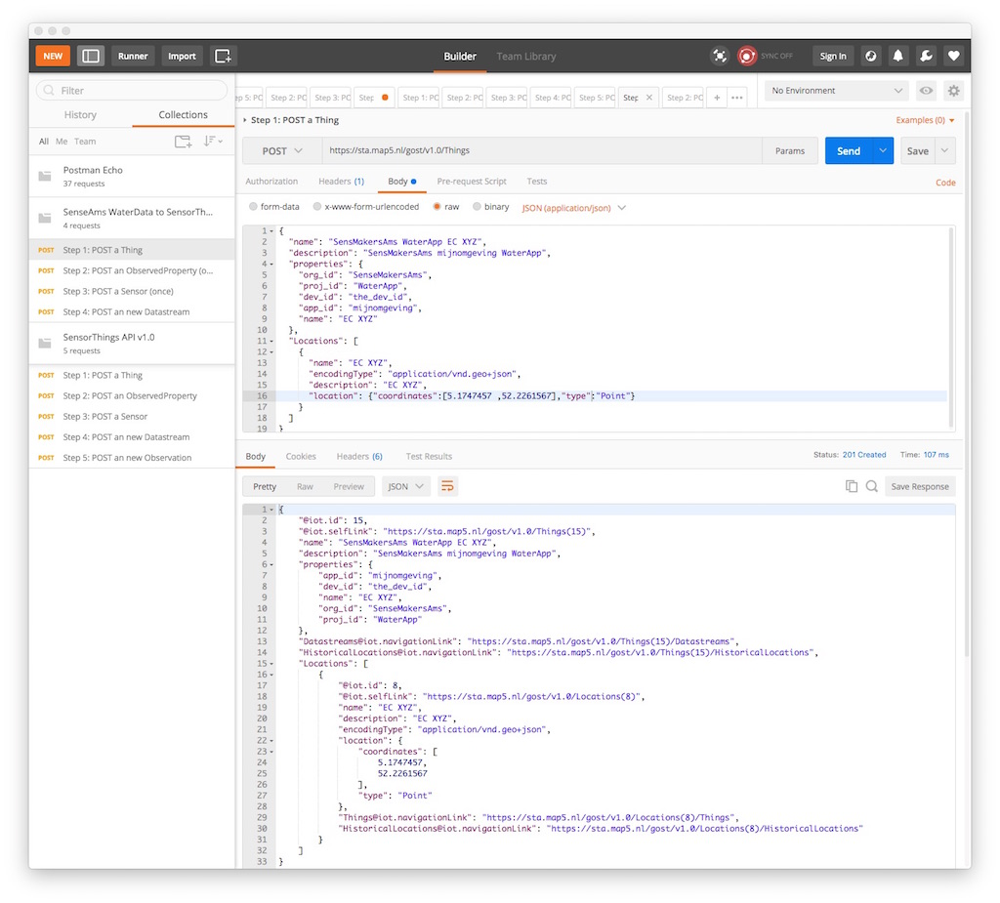
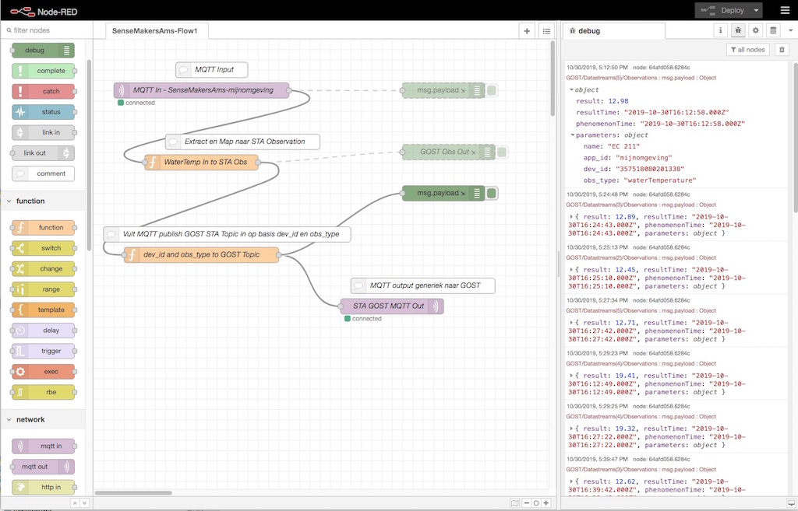

#  Water Metingen uit mijnomgeving SenseMakersAms

Door: [Just van den Broecke](https://github.com/justb4/).

De data is beschikbaar via een MQTT endpoint `mqtt.sensemakersams.org:9998` Topic `pipeline/mijnomgeving/#` .
De STA server is de GOST Server op https://sta.map5.nl/gost/v1.0 en bijbehorende MQTT (`mosquitto`) server.
In eerste instantie alleen Water Temperatuur uitgevoerd.

Dit is uitgewerkt volgens de hybride methode. 
Deze volgt dezelfde conventie als de [GOST Workshop](https://github.com/gost/workshops/blob/master/2017_foss4g_boston/3_configuration.md).
 
Er zijn twee hoofdstappen.

1) "Provisioning": aanmaken STA Entities: `Thing, Sensor, ObservedProperty, Datastream` via HTTP
2) "Observation upload": MQTT naar STA via MQTT in naar MQTT out mapping

Ad 1) dit is nodig omdat `Observations` uiteindelijk aan een `Datastream` gekoppeld moeten worden.

* Voor ieder `device` (met `dev_id` (`imei`)) wordt een `Thing` aangemaakt. 
* Eenmalig wordt voor "Water Temperatuur" een `Sensor` en `ObservedProperty` aangemaakt.
* De `Datastream` wordt aangemaakt en koppelt `Thing, Sensor, ObservedProperty` en levert een `id` voor de latere MQTT publish Topic.

We gebruiken hier `Postman` maar kan natuurlijk ook met `curl` of nog beter: in Python.

Ad 2) hierbij is volgende nodig:

* ieder inkomend MQTT bericht wordt omgezet naar een `Observation`, het `dev_id` bepaalt welk `Thing` het is
* het STA `id` van de `Datastream` bepaalt het MQTT Topic waarop gepubliceerd moet worden.

(We zouden natuurlijk ook MQTT In naar HTTP POST `Observations`, kunnen mappen maar is andere methode).

## Tools

* `mosquitto_sub` om te testen
* `Postman` voor HTTP publishing mbv "Postman Collection template"
* `NodeRed` voor MQTT naar MQTT mapping

## MQTT Mapping
Bekijk de binnenkomende berichten:  `mosquitto_sub -t pipeline/# -h mqtt.sensemakersams.org -p 9998 -u <user> -P <wachtwoord>`.

Inkomende MQTT berichten zien er zo uit (zie [hier grotere verzameling](sens-ams-1.json)): 

```
{
  "app_id": "mijnomgeving",
  "dev_id": "357518080168982",
  "payload_fields": {
    "imei": 357518080168982,
    "timestamp": 1572351009,
    "batteryVoltage": 4.21,
    "boardTemperature": 17,
    "waterEC": 294,
    "waterTemperature": 14.39,
    "Lat": 52.2261655,
    "Lon": 5.1747002,
    "altitude": 9,
    "speed": 0,
    "course": 0,
    "SatInFix": 9,
    "FixAge": 32,
    "TimeActive": 65742,
    "lastResetCause": 32
  },
  "tag_fields": {
    "name": "EC 233"
  }
}
```

Uitgaande `Observations` (zie ook de metadata in `parameters`) zo:

```
{
"result":14.39,
"resultTime":"2019-10-30T16:42:58.000Z",
"phenomenonTime":"2019-10-30T16:42:58.000Z",
"parameters": {
  "name":"EC 233",
  "app_id":"mijnomgeving",
  "dev_id":"357518080168982",
  "obs_type":"waterTemperature"
 }
}
```

## 1 - Entities in Postman aanmaken
Installeer Postman en laadt het bestand [SenseAms2STA.postman_collection.json](SenseAms2STA.postman_collection.json).
Je ziet 4 stappen. 

Voor ieder `dev_id` verzamel je de gegevens: `dev_id`, `name`, `Lat`, `Lon`, `app_id`.
Voer de 4 Stappen uit in Postman, onthoud steeds de `id` uit de velden `@iot.id` die de STA Server teruggeeft.
`Sensor, ObservedProperty` hoeft maar eenmalig voor Water Temp en is al in server aangemaakt (`id` beiden 1).
Vooral in Stap 4 moet je voor de Datastream 3 id's hebben: `Thing, Sensor, ObservedProperty`.

Zie screenshot voorbeeld:




## MQTT Mapping
Dit gebeurt in NodeRed. Laadt de flow json [nodered-flow.json](nodered-flow.json). User/Wachtwoord MQTT IN invullen!
Zie screenshot:

.

Uiteindelijk wordt hier een `Observation` JSON bericht aangemaakt en naar MQTT gepubliceerd. 
De `Topic` wordt afgeleid uit een tabel waarin `dev_id` en `waterTemp` naar een `Datastream` `id` (boven uit Postman) wordt gemapped.
De MQTT Topic voor GOST moet altijd zijn:

`/GOST/Datastreams(id)/Observations`.

Er worden twee kleine functies aangeroepen:

### Observation Mapping
Voorbeeld code `WaterTemp In to STA Obs`:

```
var json_payload = JSON.parse(msg.payload);
var date = new Date(json_payload["payload_fields"]["timestamp"] * 1000);
msg.payload = {
    "result": json_payload["payload_fields"]["waterTemperature"],
    "resultTime": date,
    "phenomenonTime": date,
    "parameters" : {
        "name": json_payload["tag_fields"]["name"],
        "app_id": json_payload["app_id"],
        "dev_id": json_payload["dev_id"],
        "obs_type": "waterTemperature"
    }
};
return msg;

``` 

### Topic Mapping
Voorbeeld code `dev_id and obs_type to GOST Topic`:

```
var topicMap = {
    "357518080166754": {
        "waterTemperature": "Datastreams(2)"
    },
    "357518080166481": {
        "waterTemperature": "Datastreams(3)"
    },
    "357518080166887": {
        "waterTemperature": "Datastreams(4)"
    },
    "357518080201338": {
        "waterTemperature": "Datastreams(5)"
    }
}
var devId = msg.payload["parameters"]["dev_id"];
var obsType = msg.payload["parameters"]["obs_type"];

if (!topicMap[devId] || !topicMap[devId][obsType]) {
    return null;
}
var datastreamId = topicMap[devId][obsType];
msg.topic = "GOST/" + datastreamId + "/Observations";
return msg;

```